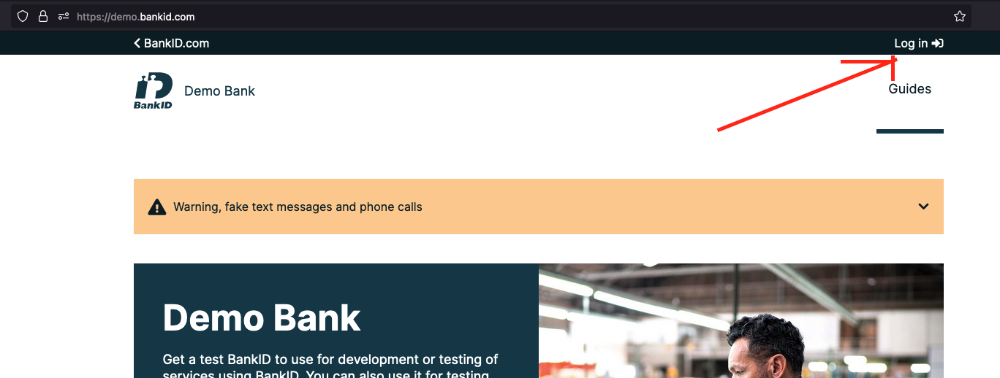
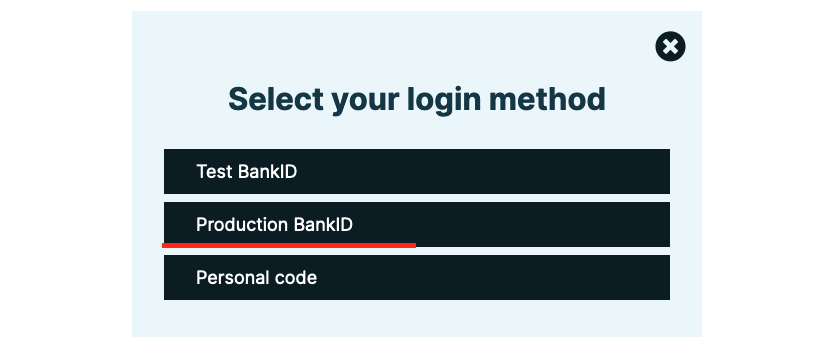
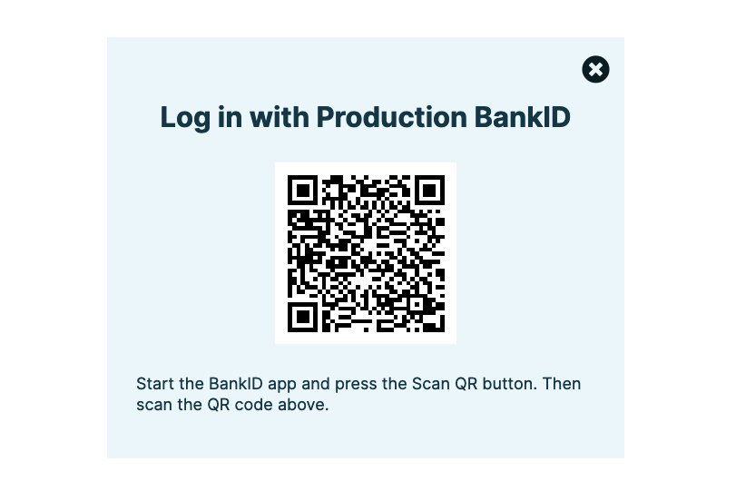
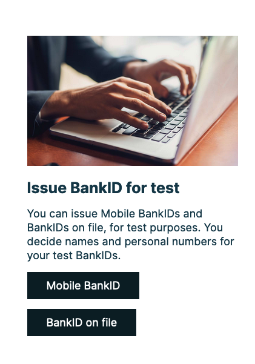
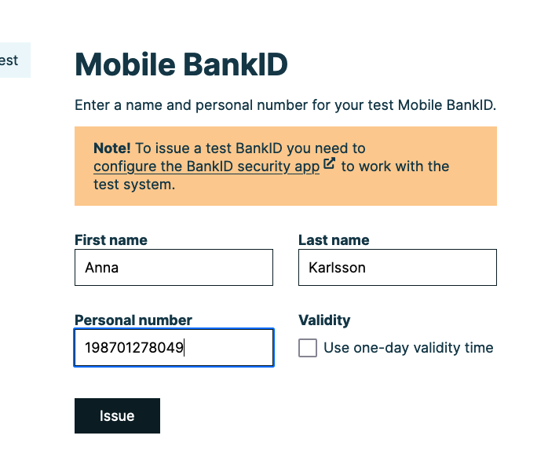
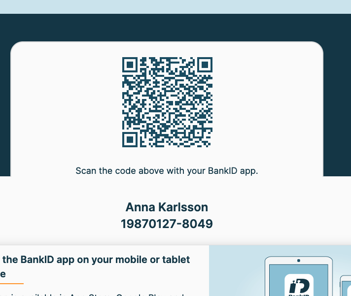

# Setting up the app for testing

First we need to change environment to use the test environment.

We do this by opening the app and tapping the Quickbit logo 5 times, then tap "staging", and then "done"


## Set up your Bank ID for testing.

To do this you first need to enable developer mode in you bank id app (warning, doing this on your private phone
might mess with Bank ID in the future)

Go to the BankID settings by going Settings > BankID > Developer. Here In the `Server` field. Enter

```
cavainternal.test.bankid.com
```


## Create and download a new BankID.

Go to https://demo.bankid.com/ and log in with you _personal_ BankID on another device.







Next, tap "Issue BankID for test"/"Mobile BankID"





You will be asked to fill in some details for your test user. Make sure that the personal number is a valid one.
You can generate valid personal numbers here: https://fejk.se/



And scan it with you _test device_ to install the BankID



Now you should be able to log in and use the app just as normal. Make sure to go though the KYC with somewhat
realistic answers not to be flagged as a risky user.
